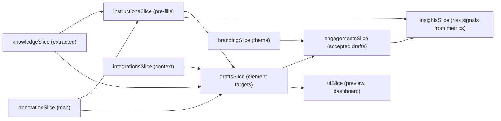

# Orbital AI Admin — UX Prototype Spec

**Product:** Orbital AI — an intelligent in-product guidance platform for B2B SaaS
**Deliverable:** A frontend-only UX prototype with mock data, targeting MailFlow as the host product
**Audience for this spec:** Designers, prototypers, and the engineer scaffolding the app
**Companion docs:** [mailflow-prototype-spec.md](mailflow-prototype-spec.md), [orbital-demo-plan.md](orbital-demo-plan.md), [mail-flow-orbital-user-journey.md](mail-flow-orbital-user-journey.md)

---

## 1. Product Overview

Orbital AI is a platform that helps Growth and Product teams set up intelligent, adaptive in-product engagements — tours, nudges, and feedback — without writing code. Instead of static walkthroughs, Orbital uses an AI agent that learns the host product's UI structure, understands business goals, and dynamically generates context-aware guidance for end-users.

This prototype covers the **admin experience**: the dashboard a Growth PM uses to teach the agent about their product and configure how it guides end-users.

### Target host product

The prototype assumes **MailFlow** (the B2B email marketing SaaS defined in [mailflow-prototype-spec.md](mailflow-prototype-spec.md)) as the product being configured. All mock data, screenshots, semantic maps, and example drafts are MailFlow-specific.

### Prototype goals

1. Visualize the full PM onboarding journey: uploading knowledge, annotating the product, defining goals, and reviewing AI-generated drafts.
2. Demonstrate how the AI agent builds understanding progressively — from docs, to UI structure, to business context — and synthesizes it into actionable guidance.
3. Be interactive enough for stakeholder walkthroughs: clickable hotspots, live-updating maps, editable fields, and simulated AI responses.

### Non-goals

See Section 10.

---

## 2. Tech Stack

| Concern | Choice | Why |
|---------|--------|-----|
| Build tool | **Vite** | Same as MailFlow prototype; fast dev server |
| Framework | **React 18** + **TypeScript** | Consistent with the existing codebase |
| Styling | **Tailwind CSS** | Rapid iteration, consistent with MailFlow |
| Routing | **React Router v6** | Client-side routing for ~17 screens |
| State | **Zustand** | Lightweight; state flows across journeys |
| Tree visualization | **Custom React component** or **react-d3-tree** | For the semantic map |
| Icons | **lucide-react** | Consistent with MailFlow |
| Animations | **framer-motion** | Typing effects, node insertions, transitions |
| Fake data | Hand-authored TS files in `src/mock/` | Deterministic, reviewable |
| Persistence | None (state resets on refresh) | Prototype-only; no backend, no localStorage |

**No backend, no database, no real AI.** All intelligence is simulated via pre-scripted flows and static mock data.

### Folder layout

```
orbital-admin/
  src/
    app/                        # AppRoot, router, providers
    components/                 # Shared UI components
    features/
      dashboard/                # Admin home / setup overview
      knowledge/                # Journey 0: doc upload + URL ingestion
      integrations/             # Integrations: MCP servers, CRMs, product analytics
      annotation/               # Journey 1: browser simulation + live semantic map
      instructions/             # Journey 2: conversational goal/metric setup
      drafts/                   # Journey 3: AI-generated tour/nudge drafts
      engagements/              # Active tours, nudges, and feedback
      insights/                 # Analytics dashboard with KPIs and risk signals
      branding/                 # Brand theme configuration for UI engagements
      settings/                 # Team management and billing
    store/                      # Zustand slices
    mock/                       # All scripted data (see Section 6)
    lib/                        # Helpers, formatters
    assets/                     # MailFlow screenshots for annotation simulation
    styles/                     # Tailwind config + custom tokens
  index.html
  tailwind.config.ts
  vite.config.ts
```

---

## 3. Information Architecture

### Global chrome

- **Left sidebar (persistent, dark):**
  - Orbital logo (custom orbital SVG icon — two crossed elliptical rings around a center dot, matching the favicon)
  - Nav items:
    - **Dashboard** (top-level)
    - **Argus Copilot** (collapsible section with sub-menus):
      - Knowledge Base
      - Annotations
      - Instructions
      - Drafts
    - **Integrations** (top-level)
    - **Engagements** (collapsible section with sub-menus):
      - All Engagements
      - Tours
      - Nudges
      - Feedback
    - **Insights** (top-level)
    - **Branding** (top-level)
    - **Settings** (collapsible section with sub-menus):
      - Team
      - Billing
  - Argus Copilot sub-items show completion indicators (empty circle / checkmark / in-progress dot)
  - Collapsible sections auto-expand when any child route is active; sub-items indent under the parent with a left border
  - **Ask Argus chat bubble** — a floating conversational AI assistant:
    - Trigger: "Ask Argus" pill button (Bot icon + label) fixed to the bottom-right corner of the viewport
    - Clicking opens a 400×540px chat panel with a branded header, welcome state with suggested prompts, and a message input
    - Welcome state: Bot icon, "Hi! I'm Argus." greeting, description text, and 3 clickable suggestion buttons
    - Chat messages: user messages in purple bubbles (right-aligned), assistant responses in grey (left-aligned)
    - Typing indicator with animated bouncing dots during simulated response delay (0.8–1.4s)
    - Mock responses match on keywords (tours, annotations, engagement best practices) for demo purposes
    - Panel opens/closes with spring animation (framer-motion)
    - Available on every page
  - Footer: workspace name ("MailFlow"), user avatar + name ("Sarah Kim, Growth PM")

- **Top bar (persistent):**
  - Page title / breadcrumb
  - Setup progress indicator (e.g., "Step 2 of 4")
  - "Preview as end-user" button (opens a modal simulating the MailFlow + Orbital widget)

### Route map

| Path | Screen | Sidebar Location | Journey |
|------|--------|------------------|---------|
| `/` | Dashboard | Dashboard | — |
| `/knowledge` | Knowledge Base | Argus Copilot → Knowledge Base | Journey 0 |
| `/integrations` | Integrations | Integrations | — |
| `/annotate` | Annotations | Argus Copilot → Annotations | Journey 1 |
| `/setup` | Instructions | Argus Copilot → Instructions | Journey 2 |
| `/suggestions` | Drafts | Argus Copilot → Drafts | Journey 3 |
| `/suggestions/:id` | Draft Detail / Edit | Argus Copilot → Drafts | Journey 3 |
| `/engagements` | All Engagements | Engagements → All Engagements | — |
| `/engagements/tours` | Tours | Engagements → Tours | — |
| `/engagements/nudges` | Nudges | Engagements → Nudges | — |
| `/engagements/feedback` | Feedback | Engagements → Feedback | — |
| `/insights` | Insights | Insights | — |
| `/branding` | Branding | Branding | — |
| `/settings` | *(redirects to Team)* | Settings | — |
| `/settings/team` | Team | Settings → Team | — |
| `/settings/billing` | Billing | Settings → Billing | — |

---

## 4. Screen Inventory

### 4.1 Dashboard — `/`

- **Purpose:** Landing page showing onboarding progress and active configuration summary.
- **Key UI:**
  - **Setup Checklist** — 4-step vertical stepper with status indicators:
    1. "Upload product knowledge" (link to `/knowledge`)
    2. "Annotate your product" (link to `/annotate`)
    3. "Define goals and instructions" (link to `/setup`)
    4. "Review AI drafts" (link to `/suggestions`)
  - Steps show: not started (grey), in progress (blue pulse), completed (green check)
  - **Active Drafts Summary** (only visible after Journey 3):
    - Count of accepted / total drafts
    - Mini cards showing top 3 active drafts with trigger type icons
  - **Semantic Map Thumbnail** (only visible after Journey 1):
    - Small interactive tree preview, clickable to navigate to `/annotate`
    - Shows: "4 pages, 18 elements annotated"
  - **Recent Activity** — mock log entries:
    - "Knowledge base updated — 3 sources ingested"
    - "Annotation complete — 18 elements across 4 pages"
    - "9 tour/nudge drafts generated"

---

### 4.2 Knowledge Base — `/knowledge` — Journey 0

- **Purpose:** PM uploads documents and shares URLs to teach the agent about the product before annotation.
- **Key UI:**

  **Left section (60%) — Input**
  - **Document Upload Zone:**
    - Drag-and-drop area with dashed border, upload icon, "Drop files here or click to browse"
    - Accepted types shown: PDF, DOCX, TXT, MD
    - On "upload" (simulated): file appears in list below with a processing spinner (1.5s), then a green "Processed" chip
    - Pre-loaded mock files available via "Load sample docs" shortcut button:
      - "MailFlow Product Guide.pdf" (mock)
      - "Pricing & Plans.md" (mock)
      - "Help Center — Getting Started.txt" (mock)
  - **URL Input:**
    - Text input + "Add URL" button
    - Added URLs appear as a list with fetch-status chips (fetching → ready)
    - Pre-loaded mock URLs available via "Load sample URLs":
      - `docs.mailflow.io/getting-started`
      - `mailflow.io/pricing`
      - `mailflow.io/changelog`

  **Right section (40%) — Extracted Knowledge**
  - Appears after at least one source is "processed"
  - Header: "Here's what I learned from your sources:"
  - **Product Summary** (editable text area):
    - "MailFlow is a B2B email marketing platform for small and mid-sized marketing teams. It helps users create, send, and measure email campaigns."
  - **Plan Tiers** (editable tag list):
    - Free: "500 contacts, basic templates, single user"
    - Pro: "Unlimited contacts, A/B testing, automations, analytics"
    - Enterprise: "Team management, integrations, priority support"
  - **Detected Activation Events** (editable chip list):
    - "First campaign sent", "Contacts imported", "Template selected", "Automation created"
  - **Paid-Only Features** (editable chip list):
    - "A/B testing", "Automations", "Advanced analytics", "Team seats"
  - **Friction Points Mentioned in Docs** (editable bullet list):
    - "Audience selection is confusing for new users"
    - "Template gallery can overwhelm first-time users"
  - Each item has a pencil icon; clicking makes it editable inline
  - Footer: "3 sources ingested. You can add more at any time."
  - **"Continue to Annotation"** button at bottom

- **Orbital anchors:** `knowledge-upload-zone`, `knowledge-url-input`, `knowledge-extracted-panel`, `knowledge-continue-btn`

---

### 4.3 Integrations — `/integrations`

- **Purpose:** PM connects external tools — MCP servers, CRMs, and product analytics platforms — so Argus can pull live context about users and product usage.
- **Key UI:**

  **Header area**
  - Page title: "Integrations"
  - Subtitle: *"Connect your tools so Argus can use real context when generating guidance."*

  **Integration Categories (tab bar or segmented filter):**
  - **All** | **MCP Servers** | **CRM** | **Product Analytics**

  **Available Integrations Grid:**
  - Each integration is a card with:
    - **Logo/icon** (e.g., Salesforce, HubSpot, Amplitude, Mixpanel, Segment, PostHog, custom MCP)
    - **Name** + **Category badge** (CRM / Analytics / MCP)
    - **One-line description**: e.g., "Sync contact properties and deal stages from HubSpot"
    - **Status badge**: "Not connected" (grey) / "Connected" (green) / "Configuring" (blue)
    - **"Connect" button** or **"Configure" button** (if already connected)

  **Mock integrations (pre-loaded):**

  | Name | Category | Description | Default Status |
  |------|----------|-------------|----------------|
  | HubSpot | CRM | Sync contact properties, deal stages, and lifecycle data | Not connected |
  | Salesforce | CRM | Pull account and opportunity data for enterprise users | Not connected |
  | Amplitude | Product Analytics | Import behavioral events and user cohorts | Not connected |
  | Mixpanel | Product Analytics | Sync event data, funnels, and retention metrics | Not connected |
  | PostHog | Product Analytics | Pull session recordings context, feature flags, and events | Not connected |
  | Segment | Product Analytics | Use Segment as a unified event source | Not connected |
  | Custom MCP Server | MCP | Connect any tool via the Model Context Protocol | Not connected |

  **Connect flow (simulated):**
  - Clicking "Connect" opens a config modal with:
    - API key / token input (mock — any value accepted)
    - "Test Connection" button → simulated 1.5s spinner → "Connection successful" toast
    - "Save" button → card updates to "Connected" (green badge)
  - For "Custom MCP Server": modal shows a server URL input + optional auth token field

  **Connected integrations panel (appears when ≥1 connected):**
  - Lists connected integrations with last-sync timestamp (mock)
  - "Disconnect" link on each
  - Summary: "2 integrations connected — Argus will use this context when generating drafts."

- **Orbital anchors:** `integrations-category-tabs`, `integrations-grid`, `integrations-connect-modal`, `integrations-connected-panel`

---

### 4.4 Annotations — `/annotate` — Journey 1

- **Purpose:** PM clicks through their product while the AI builds a semantic map of the UI in real time.
- **Layout:** Split-screen — left 60% is the simulated browser, right 40% is the live semantic map.

#### Left Panel — Simulated Browser

- **Extension Toolbar** (fixed bar above the browser frame):
  - Orbital logo + "Annotation Mode"
  - Status: "Active — click elements to teach Orbital"
  - Element counter badge: "0 elements" → updates live
  - Page selector tabs: Dashboard, Campaigns, Campaign Wizard, Automations, Settings
  - "Finish Annotation" button (right-aligned)

- **Browser Frame:**
  - Styled container with a mock URL bar showing `app.mailflow.io/...` (updates per page tab)
  - Content area shows a **static image or simplified HTML mockup** of the selected MailFlow page
  - **Clickable Hotspots** — invisible overlay regions positioned over key UI elements (see Section 5 for the full hotspot registry). On click:
    1. A colored highlight border pulses around the element (0.5s animation)
    2. A small "Captured!" toast fades in near the click point
    3. The element is added to the semantic map on the right panel
    4. The AI description card appears on the right

- **Page-specific content:**
  - **Dashboard tab:** Shows MailFlow dashboard with hotspots on KPI cards, "Create Campaign" quickstart, recent campaigns table, sidebar nav items
  - **Campaigns tab:** Shows campaign list with hotspots on "Create Campaign" button, filter bar, table rows
  - **Campaign Wizard tab:** Shows the 4-step wizard with hotspots on template gallery, audience selector, subject line input, send button
  - **Automations tab:** Shows automations list with hotspots on "Create Automation" button, trigger node, add-step button
  - **Settings tab:** Shows settings page with hotspots on billing tab, upgrade button, invite teammate button

#### Right Panel — Live Semantic Map + AI Descriptions

- **Summary Stats Bar** (top of panel):
  - "X pages · Y elements · Z flows detected"
  - Updates in real-time with each annotation

- **Semantic Map Tree:**
  - Starts empty with a prompt: "Click elements in the product to build your map"
  - As PM clicks hotspots, nodes animate into the tree:
    - **Page nodes** (folder icon) — top-level: "Dashboard", "Campaigns", "Campaign Wizard", etc.
    - **Element nodes** (nested under pages) — with type icons:
      - Button (square icon), Link (chain icon), Input (text-cursor icon), Section (layout icon)
    - **Flow connectors** — dotted lines between related nodes (e.g., "Create Campaign btn" → "Campaign Wizard page")
  - Each node shows: element name, type badge, confidence badge (High/Medium)
  - Clicking a node in the tree scrolls to / highlights its AI description below

- **AI Description Cards** (below tree, or inline-expandable per node):
  - Auto-generated when element is captured (appears after a 0.5s simulated delay with a typing animation)
  - Card contains:
    - **Element name** (bold): e.g., "Create Campaign Button"
    - **AI description** (editable textarea): e.g., *"Primary call-to-action on the dashboard that initiates the campaign creation wizard. This is a key activation point — new users who click this within their first session are 3x more likely to send their first campaign."*
    - **Tags** (clickable chips, PM can add/remove):
      - "Key Activation Point" (green)
      - "Paid Feature" (purple)
      - "Friction Risk" (amber)
      - "Navigation" (grey)
    - **Detected relationships**: "Leads to: Campaign Wizard" (auto-detected, shown as a link)
  - PM can edit any description or tag at any time

- **"Finish Annotation"** button: saves state, marks Journey 1 complete, shows a summary modal:
  - "Annotation complete! I mapped X pages, Y elements, and Z user flows. Ready to set up your goals?"
  - "Continue to Instructions" CTA

- **Orbital anchors:** `annotate-toolbar`, `annotate-browser-frame`, `annotate-page-tab-*`, `annotate-finish-btn`, `annotate-map-tree`, `annotate-description-card`

---

### 4.5 Instructions — `/setup` — Journey 2

- **Purpose:** PM defines product goals, activation points, trial structure, key metrics, and friction points via a conversational flow. These serve as instructions for Argus when generating drafts. Answers are pre-filled from Journey 0 docs where possible.
- **Layout:** Left sidebar (topics) + main chat area.

#### Left Sidebar — Topic Progress

Vertical list of conversation sections with status:

1. Product Overview — (checkmark when confirmed)
2. Activation Goals — (checkmark when confirmed)
3. Trial & Plan Structure — (checkmark when confirmed)
4. Key Metrics — (checkmark when confirmed)
5. Friction Points — (checkmark when confirmed)

Clicking a completed topic scrolls to that section in the chat. Clicking the active topic does nothing (already in view).

#### Main Chat Area

A scrolling chat thread. The agent (Orbital avatar + name) sends messages; the PM responds via editable cards and quick-reply chips.

**Opening message:**
> "Hi Sarah! I've reviewed the docs you uploaded and your product annotation. Let me walk you through a few questions so I can set up the right guidance for your users. I've pre-filled what I could — just confirm or edit."

**Topic 1: Product Overview**
- Agent: *"Here's what I understand about MailFlow:"*
- Pre-filled card (editable fields):
  - Product name: "MailFlow"
  - Category: "B2B email marketing SaaS"
  - Primary users: "Marketing managers at SMBs, Growth leads at startups"
  - Core value prop: "Fast path from contact list to measurable email campaign"
- Source attribution: "Based on: MailFlow Product Guide.pdf, mailflow.io/pricing"
- PM edits any field, clicks "Confirm"
- Agent: *"Got it. Let's talk about activation."*

**Topic 2: Activation Goals**
- Agent: *"From your docs and the UI elements you annotated, these look like key activation moments:"*
- Pre-filled chip list (add/remove/reorder):
  - "First campaign sent" (tagged: from docs)
  - "Contacts imported" (tagged: from docs)
  - "Template selected" (tagged: from annotation — user annotated template gallery)
- Agent follow-up: *"Which of these is the primary 'aha moment' — the action that most strongly predicts a user will stick around?"*
- Quick-reply chips: each activation event as an option
- PM selects "First campaign sent"
- Agent: *"That matches what I've seen in similar products. Users who send their first campaign within 48 hours have the highest retention."*

**Topic 3: Trial & Plan Structure**
- Agent: *"From your pricing page, I see these tiers:"*
- Pre-filled table (editable):

| | Free | Pro | Enterprise |
|---|---|---|---|
| Contacts | 500 | Unlimited | Unlimited |
| Features | Basic templates, campaigns | + A/B testing, automations, analytics | + Team mgmt, integrations, priority support |
| Price | $0 | $49/mo | Custom |

- Source: "Based on: Pricing & Plans.md, mailflow.io/pricing"
- Agent: *"What's the trial setup?"*
- Quick-reply chips: "14-day Pro trial", "7-day trial", "No trial, freemium only"
- PM selects "14-day Pro trial"
- Agent: *"And what happens at trial end?"*
- Quick-reply chips: "Downgrade to Free", "Lose access", "Grace period"
- PM selects "Downgrade to Free"

**Topic 4: Key Metrics**
- Agent: *"Now for the metrics that matter. What signals tell you a user is at risk of not converting — or churning?"*
- No pre-fill (these are internal business knowledge)
- Quick-reply suggestions (PM can select multiple or type custom):
  - "No campaign sent in 3+ days"
  - "Trial expiring without upgrade"
  - "Low open rates (< 15%)"
  - "No automation created by day 7"
  - "Visited pricing page but didn't upgrade"
- PM selects several and adds: "Campaign wizard abandoned mid-flow"
- Agent: *"Great, I'll use these as trigger signals for the guidance I suggest."*

**Topic 5: Friction Points**
- Agent: *"Based on your annotation and docs, I spotted some potential friction areas:"*
- Pre-filled bullets (editable):
  - "Audience selection in the campaign wizard (you tagged this as 'Friction Risk' during annotation)"
  - "Template gallery — new users may feel overwhelmed by choices"
  - "Automation builder — powerful but undiscovered by most trial users"
- Agent: *"Are there others you've observed?"*
- Free-text input + quick-reply: "Subject line writing", "Deliverability settings", "That covers it"
- PM adds one and confirms

**Completion:**
- Agent: *"Setup complete! I now have a clear picture of MailFlow, your goals, your plans, and your risk signals. Let me generate some drafts."*
- "View Drafts" CTA button appears in the chat
- Navigates to `/suggestions`

- **Orbital anchors:** `setup-sidebar`, `setup-chat-area`, `setup-topic-*`, `setup-confirm-btn`, `setup-continue-btn`

---

### 4.6 Drafts — `/suggestions` — Journey 3

- **Purpose:** Argus synthesizes knowledge from Journeys 0–2 and presents auto-generated engagement drafts (tours, nudges, feedback) with triggers, rate limits, and step previews.
- **Layout:** Full-width card list with a global settings panel at top.

#### Global Rate Limits Card (top of page)

A distinct card (subtle border, settings icon) showing AI-proposed rate limits:

- Header: "Guidance Limits" + subtext: *"To keep guidance helpful and non-intrusive, I've set these defaults:"*
- Editable limit rows (each with a number input or dropdown):

| Limit | Default | Editable |
|-------|---------|----------|
| Max tours per user per day | 2 | Number input |
| Max proactive nudges per session | 1 | Number input |
| Cooldown between nudges | 4 hours | Dropdown (1h / 2h / 4h / 8h / 24h) |
| Cooldown after dismissal | 24 hours | Dropdown |
| Max tooltips on screen at once | 1 | Number input |
| Permanent suppress after N dismissals | 3 | Number input |

- Rationale footnote: *"Based on industry benchmarks for in-product guidance. Excessive interruptions reduce engagement by ~40%."*
- **Priority ranking** (displayed as a draggable ordered list):
  1. Behavioral triggers (urgent — user is frustrated now)
  2. Metric-based triggers (timely — risk signal detected)
  3. State-based triggers (proactive — opportunity to guide)
- PM can reorder priorities by dragging

#### Drafts List

Header: *"Based on your product goals, UI structure, and documentation, Argus recommends 12 engagements:"*

Each draft is an **expandable card** with:
- **Title**: e.g., "First Campaign Activation Tour"
- **Trigger type icon + label**: State (flag) / Behavioral (cursor) / Metric (chart)
- **Trigger condition** (one-line summary): e.g., "New free user, no campaign sent in 48h"
- **Action type badge**: Tour (blue) / Nudge (amber) / Feedback (violet)
- **Kind badge** (subtype pill with icon): e.g., Spotlight, Banner, Micro Survey, NPS — only shown for nudges and feedback
- **Target segment**: e.g., "Free plan, first 7 days"
- **Actions row**: "Details" | "Edit" | "Accept" | "Dismiss"

Expanding a card reveals:
- **Rationale**: Why Argus drafted this (references specific goals/metrics/annotation data)
- **Tour steps preview**: Numbered list of steps with element names and messages
- **Trigger details**: Full condition breakdown

#### Mock Drafts (12 total)

**State-based triggers:**

1. **First Campaign Activation Tour**
   - Trigger: `plan == 'free' AND campaigns_sent == 0 AND account_age > 48h`
   - Segment: Free plan users, first 7 days
   - Action: 7-step guided tour
   - Steps: Dashboard empty state → "Create Campaign" button → Template gallery → Audience selector → Subject line → Review & Send → Post-send celebration
   - Rationale: *"Your primary activation goal is 'first campaign sent.' This tour targets the exact flow you annotated, guiding new users who haven't yet hit the aha moment."*

2. **Import Contacts Reminder**
   - Trigger: `campaigns_sent >= 1 AND contact_count < 10`
   - Segment: All users with few contacts
   - Action: Nudge → Spotlight
   - Message: "Your campaigns will have more impact with a larger audience. Import your contacts in under a minute."
   - Rationale: *"Users with fewer than 10 contacts see limited campaign value. This nudge surfaces the import flow you annotated."*

**Behavioral triggers:**

3. **Audience Selection Rescue**
   - Trigger: Rage clicks on audience dropdown (3+ clicks within 5s without progressing)
   - Segment: Any user in campaign wizard, step 2
   - Action: Nudge → Spotlight
   - Message: "Not sure who to send to? Start with 'All Contacts' for your first campaign."
   - Rationale: *"You flagged audience selection as a friction risk during annotation. This spotlight fires when a user shows signs of confusion."*

4. **Template Decision Paralysis Help**
   - Trigger: 30s+ on template gallery without selecting (dead engagement)
   - Segment: Users on wizard step 1
   - Action: Nudge → Popup
   - Message: "Newsletter templates work great for a first send. Want me to recommend one?"
   - Rationale: *"Your docs mention template choice can overwhelm new users. This popup intervenes when scrolling behavior suggests indecision."*

5. **Wizard Abandonment Recovery**
   - Trigger: Exit intent — user navigates away from campaign wizard mid-flow (step 2 or 3)
   - Segment: Users who started but didn't complete a campaign
   - Action: Nudge → Banner
   - Message: "You were halfway through creating a campaign. Want to pick up where you left off?"
   - Rationale: *"You defined 'campaign wizard abandoned mid-flow' as a risk metric. This recovers users who left before sending."*

6. **Settings Page Confusion Rescue**
   - Trigger: Scroll thrashing on settings page (rapid up/down scrolling 3+ times within 10s)
   - Segment: Any user on `/settings`
   - Action: Nudge → Spotlight
   - Message: "Looking for something specific? Billing is under the 'Billing' tab, team invites are under 'Team'."
   - Rationale: *"Settings pages with multiple tabs often cause disorientation. This fires when scroll behavior suggests the user can't find what they need."*

**Metric-based triggers:**

7. **Automation Discovery Tour**
   - Trigger: `campaigns_sent >= 3 AND automations_created == 0 AND trial_day >= 7`
   - Segment: Pro trial users, day 7+
   - Action: Tour (6-step guided tour)
   - Message: "You're getting great engagement on your campaigns. Want to automate follow-ups for people who didn't open?"
   - Tour steps: Dashboard → Automations sidebar link → Create Automation → Trigger selection → Follow-up email step → Completion
   - Rationale: *"You defined 'no automation by day 7' as a conversion risk. Automations are a paid feature — discovering them increases upgrade likelihood."*

8. **Trial Expiry Conversion Banner**
   - Trigger: `trial_days_remaining <= 3 AND has_used_paid_feature == true`
   - Segment: Trial users nearing expiry
   - Action: Nudge → Banner
   - Message: "You've been using automations and A/B testing — upgrading ensures they keep running after your trial ends."
   - Rationale: *"Tied to your 'trial expiring without upgrade' risk metric. Only shown to users who've engaged with paid features, so the message is relevant."*

9. **Engagement Drop-off Alert**
   - Trigger: `open_rate_7d < 15%`
   - Segment: Users with at least 3 sent campaigns
   - Action: Nudge → Modal
   - Message: "Your open rates dipped this week. Want tips on improving subject lines and send times?"
   - Rationale: *"Linked to your 'low open rates' risk metric. Surfaces guidance before the user gets discouraged by declining performance."*

**Feedback drafts:**

10. **Post-Onboarding Satisfaction Check**
    - Trigger: `onboarding_complete == true AND campaigns_sent >= 1`
    - Segment: All new users, post-onboarding
    - Action: Feedback → Micro Survey
    - Message: "How was your onboarding experience? (1-5 scale)"
    - Rationale: *"Gathering quick feedback immediately after onboarding helps identify friction points while the experience is fresh. Micro survey format keeps response rates high."*

11. **Monthly NPS Collection**
    - Trigger: `days_since_last_nps >= 30 AND sessions_last_7d >= 2`
    - Segment: All active users
    - Action: Feedback → NPS
    - Message: "How likely are you to recommend MailFlow to a colleague? (0-10)"
    - Rationale: *"Regular NPS tracking provides a health score for your user base. Only shown to active users to ensure meaningful responses."*

12. **Template Usefulness Rating**
    - Trigger: `campaign_sent_with_template == true`
    - Segment: Users who used templates
    - Action: Feedback → Like/Dislike
    - Message: "Was this template helpful?"
    - Rationale: *"A quick like/dislike after template use helps surface which templates drive value and which need improvement. Minimal friction ensures high response rate."*

---

### 4.7 Draft Detail / Edit — `/suggestions/:id`

- **Purpose:** Full editing view for a single draft.
- **Key UI:**

  **Header:**
  - Draft title (editable)
  - Accept / Dismiss action buttons
  - "Preview Tour" button
  - "Back to Drafts" breadcrumb

  **Trigger Conditions Panel:**
  - Visual builder with dropdowns and chips, grouped by type:
    - **State conditions:** "When user [has / has not] [action dropdown] within [time dropdown]"
    - **Behavioral conditions:** "When user exhibits [rage clicks / dead clicks / exit intent / scroll thrashing / decision paralysis] on [element from semantic map dropdown]"
    - **Metric conditions:** "When [metric dropdown] [is above / is below] [threshold input]"
    - **Combinators:** AND/OR toggles between conditions
    - **Segment filters:** Plan tier dropdown, trial day range, account age range
  - Each condition row has a delete button; "Add condition" button at bottom

  **Tour Steps Editor:**
  - Ordered list of steps, each containing:
    - **Target element** — dropdown populated from the semantic map (shows element name + page)
    - **Message** — editable textarea with the agent's suggested copy
    - **Advance condition** — dropdown: "On click" / "On navigation" / "After N seconds" / "On event"
  - Drag handles to reorder steps
  - "Add step" and "Remove" buttons
  - Step count shown: "7 steps"

  **Timing & Schedule:**
  - Radio group: Always active / Date range / One-time per user
  - Delay input: "Show X seconds after trigger fires" (default: 2s)

  **Rate Limit Override:**
  - Toggle: "Use global limits" (default on) / "Custom for this draft"
  - If custom: same fields as global card (max per day, cooldown, etc.)

  **Preview Thumbnail:**
  - Small screenshot of the target MailFlow page with the first tour step overlay shown
  - Clicking opens the full preview modal

- **Orbital anchors:** `draft-edit-title`, `draft-edit-triggers`, `draft-edit-steps`, `draft-edit-timing`, `draft-edit-preview-btn`

---

### 4.8 Tour Preview Modal

- **Purpose:** Shows the PM exactly what an end-user would see.
- **Key UI:**
  - Full-screen modal with a simulated MailFlow browser frame
  - The selected draft's tour plays step-by-step:
    - Spotlight highlight on the target element (darkened backdrop + cutout)
    - Tooltip card with Orbital avatar, step message, step counter (1/7), Next/Back buttons
  - PM clicks "Next" to advance through steps manually
  - "Close Preview" button returns to the draft detail or list

---

### 4.9 Engagements — `/engagements`

- **Purpose:** Lists all active guidance engagements — tours, nudges, and feedback — that are live or paused. This is the operational view of what end-users actually see.
- **Key UI:**

  **Summary Cards Row (4 cards):**
  - Total Engagements count
  - Active count (green)
  - Tours + Nudges breakdown with badges
  - Feedback count with badge

  **Filter Tabs:**
  - All | Tours | Nudges | Feedback
  - Selected tab filters the table below

  **Engagements Table:**
  - Columns: Name, Type (badge: Tour/Nudge/Feedback), Kind (subtype pill: e.g., Spotlight, NPS, Banner), Status (badge: Active/Paused/Draft), Segment, Last Triggered, Conversion Rate
  - Kind column shows a color-coded pill with icon for the subtype (only for nudges and feedback; tours have no subtype)
  - Action buttons per row: Pause/Resume toggle, Archive (delete)
  - Empty state with CTA linking to Drafts page

  **Engagement types and subtypes:**

  | Type | Subtypes |
  |------|----------|
  | Tour | *(none)* |
  | Nudge | Spotlight, Checklist, Banner, Popup, Modal |
  | Feedback | Micro Survey, NPS, Like/Dislike, Star Rating, Large Survey |

  **Sub-pages:**
  - `/engagements/tours` — filtered view showing only tours
  - `/engagements/nudges` — filtered view showing only nudges
  - `/engagements/feedback` — filtered view showing only feedback
  - All three share the same `EngagementsPage` component with a `filterType` prop

  **Mock data (13 engagements):**
  - 2 tours: First Campaign Activation Tour, Automation Discovery Tour
  - 6 nudges: 2 spotlights, 1 checklist, 1 banner, 1 popup, 1 modal
  - 5 feedback: 1 micro survey, 1 NPS, 1 like/dislike, 1 star rating, 1 large survey
  - Each has mock impressions, completions, dismissals, and conversion rate

- **Orbital anchors:** `engagements-summary`, `engagements-filter-tabs`, `engagements-table`

---

### 4.10 Insights — `/insights`

- **Purpose:** Analytics dashboard showing key metrics tied to the goals and risk signals the PM defined in the Argus Copilot Instructions step.
- **Key UI:**

  **KPI Cards Row (4 cards):**
  - Activation Rate (34.2%, +5.3% vs last week)
  - Trial Conversion (18.7%, +2.1%)
  - Avg Time to Aha Moment (2.3 days, -0.4 days — lower is better)
  - Engagement Reach (72.4%, +8.6%)
  - Each card shows a 7-day trend sparkline (SVG polyline) and a change indicator with TrendingUp/TrendingDown icon

  **Risk Signals Panel:**
  - Grid of cards, one per risk metric from `setupAnswers.riskMetrics`
  - Each shows: signal label, severity badge (High/Medium/Low), affected user count, one-line description
  - Mock signals: "No campaign sent in 3+ days" (42 users, high), "Trial expiring without upgrade" (18 users, high), "Low open rates" (27 users, medium), "No automation by day 7" (35 users, medium), "Campaign wizard abandoned" (14 users, low), "Visited pricing but didn't upgrade" (23 users, low)

  **Engagement Performance Table:**
  - Columns: Engagement name, Type badge, Impressions, Completions, Dismissals, Conversion Lift
  - Shows performance data for each active engagement

- **Orbital anchors:** `insights-kpi-cards`, `insights-risk-signals`, `insights-performance-table`

---

### 4.11 Branding — `/branding`

- **Purpose:** Configures the visual theme applied to all user-facing UI engagements (tours, nudges, and feedback).
- **Layout:** 60/40 split — left has import + settings form, right has live preview.

  **Import Brand Panel (Card):**
  - **Upload Style Guide:** Drag-and-drop zone (PDF, PNG, SVG). Simulated upload marks as "uploaded" and triggers auto-detection.
  - **Reference URL:** Text input + fetch button. After 1.5s simulated extraction, shows "Brand tokens auto-detected" with a checkmark.
  - Both methods populate the Brand Settings form with auto-detected values.

  **Brand Settings Form (Card):**
  - **Primary Color** — color picker + hex input (default: `#7c5cfc`)
  - **Secondary Color** — color picker + hex input (default: `#3b82f6`)
  - **Font Family** — dropdown: Inter, System Default, Roboto, Open Sans, DM Sans
  - **Border Radius** — range slider 0–16px with live value label
  - **Button Style** — radio/toggle: Filled, Outlined, Rounded Pill
  - **Logo** — file upload with real `FileReader` preview. Shows uploaded image thumbnail, Replace and Remove buttons after upload.

  **Live Preview Panel (sticky, right side):**
  - Simulated browser chrome (traffic light dots + URL bar)
  - Mock tooltip card styled with current brand settings (colors, font, radius, button style, logo)
  - Mock nudge card styled with current brand settings (secondary color accent border)
  - Updates in real-time as settings change

  **Auto-detected brand tokens (from URL fetch or style guide upload):**
  - Primary: `#6366f1`, Secondary: `#8b5cf6`, Font: DM Sans, Radius: 12px, Button style: Rounded Pill

- **Orbital anchors:** `branding-import-panel`, `branding-settings-form`, `branding-preview`

---

### 4.12 Settings — Team (`/settings/team`)

- **Purpose:** Manage team members and their access levels.
- **Key UI:**

  **Team Members Table:**
  - Columns: Member (avatar initials + name + email), Role (badge: Admin/Editor/Viewer), Status (badge: Active/Invited), Last Active, Actions
  - Actions menu (three-dot dropdown): Set as Admin, Set as Editor, Set as Viewer, Remove
  - Current role is highlighted in the dropdown

  **Invite Teammate Modal:**
  - Email input + role selector (three toggle buttons: Admin / Editor / Viewer)
  - Send Invite button → adds member to list with "Invited" status

  **Mock team members (4):**
  - Sarah Kim (Admin, active), James Chen (Editor, active), Priya Patel (Editor, active), Alex Rivera (Viewer, invited)

- **Orbital anchors:** `settings-team-table`, `settings-invite-modal`

---

### 4.13 Settings — Billing (`/settings/billing`)

- **Purpose:** Manage subscription plan and view billing history.
- **Key UI:**

  **Current Plan Card:**
  - Plan name + Active badge, monthly price, seats used/total, engagements active/limit
  - Payment method display (mock Visa ending in 4242) with Update link
  - Change Plan button

  **Plan Comparison Grid (3 cards):**
  - Free ($0/mo): 1 seat, 3 engagements, basic analytics, email support
  - Pro ($99/mo, current): 5 seats, 25 engagements, advanced analytics, priority support, custom branding, API access
  - Enterprise (Custom): unlimited seats/engagements, full analytics, dedicated CSM, SSO, SLA
  - Current plan card has a ring highlight; others show Upgrade/Downgrade/Contact Sales buttons

  **Billing History Table:**
  - Columns: Date, Description, Amount, Status (badge: Paid/Pending/Failed)
  - 5 mock entries (monthly Pro Plan charges, all paid)

- **Orbital anchors:** `settings-billing-plan`, `settings-billing-comparison`, `settings-billing-history`

---

## 5. Annotation Hotspot Registry

Every clickable region in the simulated browser maps to a hotspot definition. The prototype ships these as a single registry in `src/mock/hotspots.ts`.

### Dashboard Page

| Hotspot ID | Element | Type | AI Description | Tags |
|------------|---------|------|----------------|------|
| `hs-dash-kpi-sent` | "Emails Sent" KPI card | Section | "Top-level metric card showing total emails sent in the last 30 days. Gives users immediate feedback on campaign activity." | — |
| `hs-dash-kpi-openrate` | "Avg Open Rate" KPI card | Section | "Displays the average open rate across all campaigns. A key health indicator for email performance." | — |
| `hs-dash-quickstart-create` | "Create a campaign" quickstart | Button | "Primary call-to-action on the dashboard that initiates the campaign creation wizard. Key activation point — new users who click this within their first session are 3x more likely to send their first campaign." | Key Activation Point |
| `hs-dash-quickstart-import` | "Import contacts" quickstart | Button | "Secondary quickstart action for importing contacts. Prerequisite for meaningful campaign sends." | Key Activation Point |
| `hs-dash-recent-table` | Recent campaigns table | Section | "Shows the 5 most recent campaigns with status and key metrics. Provides at-a-glance performance feedback." | — |
| `hs-dash-sidebar-campaigns` | Sidebar: Campaigns | Link | "Primary navigation to the campaigns list. Most-used nav item after dashboard." | Navigation |
| `hs-dash-sidebar-automations` | Sidebar: Automations | Link | "Navigation to automations. This is a paid-plan feature area that trial users often don't discover." | Paid Feature |
| `hs-dash-sidebar-settings` | Sidebar: Settings | Link | "Navigation to settings including billing, team, and integrations." | Navigation |

### Campaign Wizard Page

| Hotspot ID | Element | Type | AI Description | Tags |
|------------|---------|------|----------------|------|
| `hs-wizard-template-gallery` | Template gallery grid | Section | "Step 1 of campaign creation. Users choose from categorized templates. Can cause decision paralysis for new users." | Friction Risk |
| `hs-wizard-audience-dropdown` | Audience selector | Input | "Step 2 — audience selection dropdown. Users choose a segment or 'All Contacts'. Frequently confusing for first-time users who haven't created segments yet." | Friction Risk |
| `hs-wizard-subject-input` | Subject line field | Input | "Step 3 — subject line input. Drives open rates. Many users struggle with writing effective subjects." | — |
| `hs-wizard-add-variant` | "Add A/B variant" button | Button | "Adds a second subject line for split testing. This is a Pro-only feature. Free users see this but can't use it." | Paid Feature |
| `hs-wizard-send-btn` | "Send Campaign" button | Button | "Final CTA in the wizard. Clicking this sends the campaign and completes the primary activation goal." | Key Activation Point |

### Automations Page

| Hotspot ID | Element | Type | AI Description | Tags |
|------------|---------|------|----------------|------|
| `hs-auto-create-btn` | "Create Automation" button | Button | "Primary CTA to start building an automation workflow. Automations are a key paid feature that drives conversion." | Paid Feature, Key Activation Point |
| `hs-auto-trigger-node` | Trigger selection node | Section | "First step in the automation builder — user chooses what starts the workflow (e.g., 'Contact added', 'Email not opened')." | — |
| `hs-auto-add-step` | "Add Step" button | Button | "Adds a new action to the automation sequence. The builder uses a linear stepper layout." | — |

### Settings Page

| Hotspot ID | Element | Type | AI Description | Tags |
|------------|---------|------|----------------|------|
| `hs-settings-billing-tab` | Billing tab | Link | "Navigation to the billing section showing current plan, invoices, and upgrade option." | Navigation |
| `hs-settings-upgrade-btn` | "Upgrade" button | Button | "Primary conversion CTA on the billing page. Initiates the upgrade flow." | Key Activation Point |
| `hs-settings-invite-btn` | "Invite Teammate" button | Button | "Opens the team invite modal. Expansion signal — users who invite teammates are more likely to upgrade to Enterprise." | — |

---

## 6. Mock Data

All mock data lives under `src/mock/` as typed TypeScript files.

### `src/mock/knowledge-sources.ts`

```ts
type KnowledgeSource = {
  id: string;
  type: 'document' | 'url';
  name: string;
  status: 'processing' | 'ready' | 'failed';
  addedAt: string;
};

type ExtractedKnowledge = {
  productSummary: string;
  planTiers: { name: string; features: string[]; price: string }[];
  activationEvents: string[];
  paidFeatures: string[];
  frictionPoints: string[];
};
```

### `src/mock/integrations.ts`

```ts
type Integration = {
  id: string;
  name: string;
  category: 'crm' | 'product_analytics' | 'mcp';
  description: string;
  logo: string; // icon name or path
  status: 'not_connected' | 'configuring' | 'connected';
  lastSync?: string;
  config?: {
    apiKey?: string;
    serverUrl?: string;
  };
};
```

### `src/mock/hotspots.ts`

```ts
type Hotspot = {
  id: string;
  page: 'dashboard' | 'campaigns' | 'wizard' | 'automations' | 'settings';
  elementName: string;
  elementType: 'button' | 'link' | 'input' | 'section';
  position: { top: string; left: string; width: string; height: string };
  aiDescription: string;
  tags: ('Key Activation Point' | 'Paid Feature' | 'Friction Risk' | 'Navigation')[];
  confidence: 'high' | 'medium';
  relatedTo?: string[];  // IDs of related hotspots (e.g., button → page it opens)
};
```

### `src/mock/conversations.ts`

```ts
type AgentMessage = {
  id: string;
  topic: 'overview' | 'activation' | 'plans' | 'metrics' | 'friction';
  type: 'agent' | 'prefill-card' | 'quick-reply' | 'completion';
  content: string;
  prefillData?: Record<string, unknown>;
  quickReplies?: { label: string; value: string }[];
  sourceAttribution?: string;
};
```

Pre-scripted conversation is an ordered array of `AgentMessage` objects. The UI advances through the array as the PM confirms each topic.

### `src/mock/drafts.ts`

```ts
type TriggerCondition =
  | { type: 'state'; field: string; op: 'eq' | 'neq' | 'gt' | 'lt' | 'gte' | 'lte'; value: string | number | boolean }
  | { type: 'behavioral'; behavior: 'rage_clicks' | 'dead_clicks' | 'scroll_thrashing' | 'exit_intent' | 'decision_paralysis' | 'back_and_forth'; targetElement?: string; threshold?: string }
  | { type: 'metric'; metric: string; op: 'above' | 'below' | 'equals'; value: number };

type DraftStep = {
  targetHotspotId: string;
  message: string;
  advanceOn: 'click' | 'navigation' | 'timer' | 'event';
};

type Draft = {
  id: string;
  title: string;
  status: 'draft' | 'accepted' | 'dismissed';
  triggerType: 'state' | 'behavioral' | 'metric';
  triggers: TriggerCondition[];
  segment: string;
  actionType: 'tour' | 'nudge' | 'feedback';
  actionSubType?: EngagementSubType;  // from engagements.ts
  steps: DraftStep[];
  rationale: string;
  priority: number;
};

type RateLimits = {
  maxToursPerDay: number;
  maxNudgesPerSession: number;
  cooldownBetweenNudgesHours: number;
  cooldownAfterDismissalHours: number;
  maxTooltipsOnScreen: number;
  permanentSuppressAfterDismissals: number;
  priorityOrder: ('behavioral' | 'metric' | 'state')[];
};
```

### `src/mock/engagements.ts`

```ts
type EngagementType = 'tour' | 'nudge' | 'feedback';
type EngagementStatus = 'active' | 'paused' | 'draft';

type FeedbackSubType = 'micro-survey' | 'nps' | 'like-dislike' | 'star-rating' | 'large-survey';
type NudgeSubType = 'spotlight' | 'checklist' | 'banner' | 'popup' | 'modal';
type EngagementSubType = FeedbackSubType | NudgeSubType;

type Engagement = {
  id: string;
  name: string;
  type: EngagementType;
  subType?: EngagementSubType;
  status: EngagementStatus;
  triggerSummary: string;
  segment: string;
  lastTriggered: string;
  impressions: number;
  completions: number;
  dismissals: number;
  conversionRate: number;
  linkedDraftId: string | null;
};
```

### `src/mock/insights.ts`

```ts
type KpiMetric = {
  id: string;
  label: string;
  value: string;
  change: number;      // percentage vs last week
  trend: number[];     // 7 data points for sparkline
};

type RiskSignal = {
  id: string;
  label: string;
  userCount: number;
  severity: 'high' | 'medium' | 'low';
  description: string;
};

type EngagementPerformance = {
  engagementId: string;
  name: string;
  type: 'tour' | 'nudge' | 'feedback';
  impressions: number;
  completions: number;
  dismissals: number;
  conversionLift: number;
};
```

### `src/mock/branding.ts`

```ts
type ButtonStyle = 'filled' | 'outlined' | 'rounded-pill';

type BrandSettings = {
  primaryColor: string;
  secondaryColor: string;
  fontFamily: string;
  borderRadius: number;
  logoUrl: string | null;
  buttonStyle: ButtonStyle;
};
```

### `src/mock/settings.ts`

```ts
type TeamRole = 'admin' | 'editor' | 'viewer';
type MemberStatus = 'active' | 'invited';

type TeamMember = {
  id: string;
  name: string;
  email: string;
  role: TeamRole;
  status: MemberStatus;
  lastActive: string;
  avatarInitials: string;
};

type BillingPlan = 'free' | 'pro' | 'enterprise';

type BillingHistory = {
  id: string;
  date: string;
  description: string;
  amount: string;
  status: 'paid' | 'pending' | 'failed';
};

type BillingInfo = {
  currentPlan: BillingPlan;
  monthlyPrice: string;
  seatsUsed: number;
  seatsTotal: number;
  engagementsActive: number;
  engagementsLimit: number;
  paymentMethod: string;
  billingHistory: BillingHistory[];
};
```

### `src/mock/setup-answers.ts`

Stores the PM's confirmed answers from Journey 2. Pre-populated with defaults matching the conversation script so the prototype can show Journey 3 even if Journey 2 is skipped.

```ts
type SetupAnswers = {
  productName: string;
  productCategory: string;
  primaryUsers: string;
  valueProposition: string;
  activationEvents: string[];
  primaryAhaMoment: string;
  planTiers: { name: string; features: string[]; price: string }[];
  trialLength: string;
  trialEndBehavior: string;
  riskMetrics: string[];
  frictionPoints: string[];
};
```

---

## 7. Zustand Store

### Slices

| Slice | State | Key Actions |
|-------|-------|-------------|
| `knowledgeSlice` | `sources: KnowledgeSource[]`, `extracted: ExtractedKnowledge`, `isProcessing: boolean` | `addSource()`, `removeSource()`, `updateExtractedField()`, `loadSampleDocs()` |
| `annotationSlice` | `capturedElements: CapturedElement[]`, `activePage: string`, `mapNodes: MapNode[]` | `captureElement(hotspotId)`, `updateDescription(id, text)`, `addTag(id, tag)`, `removeTag(id, tag)`, `setActivePage(page)` |
| `integrationsSlice` | `integrations: Integration[]`, `connectedCount: number` | `connectIntegration(id)`, `disconnectIntegration(id)`, `testConnection(id)` |
| `instructionsSlice` | `answers: SetupAnswers`, `currentTopic: number`, `completedTopics: number[]` | `confirmTopic(topic, data)`, `updateAnswer(field, value)`, `goToTopic(index)` |
| `draftsSlice` | `drafts: Draft[]` (12 total: tours, nudges, feedback with subtypes), `rateLimits: RateLimits`, `isGenerating: boolean` | `acceptDraft(id)`, `dismissDraft(id)`, `updateDraft(id, data)`, `updateRateLimits(limits)`, `generateDrafts()` |
| `engagementsSlice` | `engagements: Engagement[]` | `pauseEngagement(id)`, `resumeEngagement(id)`, `archiveEngagement(id)` |
| `brandingSlice` | `brandSettings: BrandSettings`, `styleGuideUrl: string`, `isExtracting: boolean` | `updateBrandSetting(field, value)`, `fetchBrandFromUrl(url)` |
| `settingsSlice` | `teamMembers: TeamMember[]`, `billingInfo: BillingInfo` | `inviteMember(email, role)`, `updateMemberRole(id, role)`, `removeMember(id)` |
| `uiSlice` | `sidebarCollapsed: boolean`, `argusExpanded: boolean`, `currentJourney: number`, `previewOpen: boolean`, `previewDraftId: string | null`, `askArgusOpen: boolean` | `toggleSidebar()`, `toggleArgusSection()`, `setJourney(n)`, `openPreview(id)`, `closePreview()`, `toggleAskArgus()` |

### Cross-slice data flow



---

## 8. Design System

### Tokens (Orbital brand — distinct from MailFlow)

| Token | Value | Notes |
|-------|-------|-------|
| `--orbital-bg` | `#0f1117` | Dark background for sidebar |
| `--orbital-surface` | `#1a1d27` | Card/panel surface in dark areas |
| `--orbital-surface-light` | `#ffffff` | Main content area |
| `--orbital-primary` | `#7c5cfc` | Violet/indigo accent |
| `--orbital-primary-hover` | `#6a4ce0` | |
| `--orbital-text` | `#e2e8f0` | Light text on dark surfaces |
| `--orbital-text-dark` | `#0f172a` | Dark text on light surfaces |
| `--orbital-text-muted` | `#94a3b8` | Secondary text |
| `--orbital-border` | `#2a2d3a` | Borders on dark surfaces |
| `--orbital-border-light` | `#e2e8f0` | Borders on light surfaces |
| `--orbital-success` | `#10b981` | Completed states, accepted |
| `--orbital-warning` | `#f59e0b` | Friction risk, medium confidence |
| `--orbital-danger` | `#ef4444` | Failed states |
| `--orbital-info` | `#3b82f6` | In-progress, suggested |
| `--radius` | `8px` | |
| `--radius-lg` | `12px` | |
| `--font` | `"Inter", system-ui, sans-serif` | |

### Components to build

`Button` (primary, secondary, ghost, danger), `IconButton`, `Input`, `Textarea`, `Select`, `Chip` (removable, editable), `Card` (expandable), `Modal`, `Tooltip`, `Badge` (status, trigger-type), `Tabs`, `Tree` (animated node insertion), `ChatBubble` (agent / user / prefill-card), `QuickReplyChips`, `ProgressStepper`, `DragHandle`, `EditableText` (inline edit on click), `SplitPane`, `BrowserFrame`, `HotspotOverlay`, `TourSpotlight`, `ProcessingSpinner`, `TypingAnimation`, `AskArgus` (floating chat bubble with conversational AI assistant panel).

### Trigger type visual language

| Trigger Type | Icon | Color | Badge |
|-------------|------|-------|-------|
| State-based | Flag | `slate-500` | Grey pill |
| Behavioral | MousePointerClick | `amber-500` | Amber pill |
| Metric-based | BarChart3 | `blue-500` | Blue pill |

### Tag visual language

| Tag | Color |
|-----|-------|
| Key Activation Point | `emerald` bg, dark text |
| Paid Feature | `violet` bg, white text |
| Friction Risk | `amber` bg, dark text |
| Navigation | `slate` bg, dark text |

---

## 9. Interactivity Requirements

### Journey 0 — Knowledge Base
- "Load sample docs" instantly populates 3 files + 3 URLs with "ready" status
- Manual upload shows a processing spinner for 1.5s per file, then flips to "ready"
- Extracted knowledge panel renders item-by-item with a 200ms stagger animation
- All extracted fields are editable inline (click pencil icon → input mode → click away to save)
- "Continue" button is disabled until at least 1 source is "ready"

### Journey 1 — Annotation
- Page tabs switch the browser frame content (static image swap, 200ms fade transition)
- Hotspot click: 0.5s pulse highlight → "Captured!" toast → node appears in tree with slide-in animation → AI description card populates with typing animation (0.5s delay, 30ms per character)
- Clicking an already-captured hotspot re-highlights it and scrolls the right panel to its description
- Tree nodes are collapsible by page group
- Description textareas auto-save on blur
- Tags are added/removed via a chip input (type + Enter, or click predefined tag buttons)
- "Finish Annotation" shows a summary modal and marks Journey 1 complete
- If the PM navigates away without finishing, state persists in Zustand (lost on refresh)

### Journey 2 — Instructions
- Chat auto-scrolls to the latest message
- Pre-fill cards have a subtle "AI-generated" badge and source attribution text
- Editing a pre-fill card: click on any field → it becomes an input → edit → click "Confirm" to lock
- Quick-reply chips: click to select (multi-select where noted), selected chips get a checkmark
- After confirming a topic, the sidebar item gets a green checkmark and the next topic auto-starts
- PM can click a completed sidebar topic to scroll back and re-edit (unlocks the card)
- "View Drafts" button pulses gently to draw attention after completion

### Journey 3 — Drafts
- Page loads with a 3s "generating" animation (pulsing dots + rotating messages: "Analyzing your product structure…", "Matching goals to UI elements…", "Generating recommendations…")
- Draft cards animate in one by one (200ms stagger)
- Each card shows: title, trigger type badge, action type badge (Tour/Nudge/Feedback), subtype kind pill (e.g., Spotlight, NPS), trigger summary, segment
- No status badges on cards — status is managed through Accept/Dismiss actions and the dismissed section
- Expand/collapse cards with smooth height transition
- "Accept" keeps card in the active list
- "Dismiss" greys out the card, moves it to the dismissed section at bottom
- "Details" toggles the expanded view showing rationale, steps, and trigger conditions
- "Edit" navigates to `/suggestions/:id` detail page
- Rate limits card: number inputs with +/- steppers, dropdowns for time units
- Priority list: drag to reorder (framer-motion drag)

### Engagements
- Summary cards update counts when engagements are paused/resumed/archived
- Filter tabs switch the table view instantly
- Pause/Resume toggles update status badge inline
- Archive removes the row with a brief fade-out
- Empty state shows when all engagements are archived, with a CTA to Drafts

### Insights
- KPI cards display SVG sparklines rendered from 7-day trend arrays
- Change indicators show green TrendingUp or red TrendingDown icons
- Risk signal cards are static mock data (no live updates)
- Engagement performance table is read-only mock data

### Branding
- Style guide upload uses a native file input; simulated 1.5s processing
- URL fetch triggers 1.5s spinner then auto-populates brand settings with detected values
- All brand setting changes update the live preview panel in real-time
- Logo upload reads file via `FileReader.readAsDataURL()` and displays actual image preview
- Preview panel shows a mock tooltip and nudge card styled with current settings

### Settings
- Team: Invite modal validates email is non-empty before enabling the Send button
- Team: Role dropdown updates the member's role inline
- Team: Remove action filters the member out of the list
- Billing: Plan comparison cards highlight the current plan; action buttons are simulated (no real upgrade/downgrade)
- Billing: History table is static mock data

### Ask Argus (Floating Chat Bubble)
- "Ask Argus" pill button floats at the bottom-right of the viewport on every page
- Clicking the button opens the chat panel with a spring animation; the trigger button hides while the panel is open
- Welcome state shows a Bot icon, greeting, description, and 3 suggestion buttons (clicking a suggestion sends it as a message)
- User messages appear instantly in purple bubbles (right-aligned); assistant typing indicator (3 bouncing dots) shows for 0.8–1.4s before the response appears in grey bubbles (left-aligned)
- Mock responses are keyword-matched: "tour" → tour setup guidance, "annotation" → annotation tips, "engagement" / "best practice" → engagement best practices, default → general help
- Chat auto-scrolls to the latest message; input auto-focuses when panel opens
- Close button (X) in the header dismisses the panel and restores the floating trigger button

### Global
- Sidebar nav items update their completion indicators as journeys progress
- Dashboard setup checklist reflects real journey completion state
- All transitions use framer-motion with 200-300ms duration
- No data persists across page refresh (acceptable for a prototype)

---

## 10. Non-Goals

Explicitly out of scope:

- Any backend, API, or database
- Real AI/LLM integration or RAG pipeline
- Actual document parsing (all extractions are pre-scripted)
- Real browser extension (annotation uses simulated hotspots)
- Authentication, sign-up, or multi-tenant support
- Mobile or responsive layouts (desktop-only, min 1280px)
- Real-time collaboration between multiple PMs
- Integration with the live MailFlow prototype (annotation uses static screenshots/mockups)
- Accessibility audit (reasonable defaults: focus rings, labels, contrast)
- Dark mode toggle (the admin UI uses a fixed dark-sidebar / light-content layout)

---

## 11. Asset Requirements

The annotation simulation needs static visual assets for the MailFlow pages:

| Asset | Description | Used In |
|-------|-------------|---------|
| `mailflow-dashboard.png` | Screenshot of MailFlow dashboard (empty state variant) | Annotation — Dashboard tab |
| `mailflow-campaigns.png` | Screenshot of MailFlow campaigns list | Annotation — Campaigns tab |
| `mailflow-wizard.png` | Screenshot of MailFlow campaign wizard (step 1–4 composite or step 1) | Annotation — Campaign Wizard tab |
| `mailflow-automations.png` | Screenshot of MailFlow automations list | Annotation — Automations tab |
| `mailflow-settings.png` | Screenshot of MailFlow settings page (billing tab) | Annotation — Settings tab |

These can be actual screenshots from the running MailFlow prototype, or simplified mockup images. Hotspot positions in `src/mock/hotspots.ts` are defined as CSS percentage coordinates relative to these images.

---

## 12. Build Order

1. Scaffold Vite + React + TS + Tailwind, install deps (zustand, react-router, framer-motion, lucide-react).
2. Build the design system: tokens, base components (Button, Card, Input, Chip, Modal, etc.).
3. Build the app shell: sidebar (with collapsible sections for Argus Copilot, Engagements, Settings + top-level Insights, Branding), top bar, routing, and the Ask Argus floating chat bubble.
4. Build the Zustand store with all slices and mock data files.
5. **Journey 0:** Knowledge Base screen (upload zone, URL input, extracted knowledge panel).
6. **Integrations:** Integrations screen (integration cards, connect modal, connected panel).
7. **Journey 1:** Annotations screen (browser frame, hotspot overlays, live semantic map tree, AI description cards).
8. **Journey 2:** Instructions chat (chat UI, pre-fill cards, quick-reply chips, topic sidebar).
9. **Journey 3:** Drafts list (rate limits card, draft cards, expand/collapse, accept/dismiss).
10. **Journey 3 cont.:** Draft detail/edit page (trigger builder, step editor, timing controls).
11. Tour Preview modal (simulated MailFlow frame + spotlight overlay).
12. Dashboard (setup checklist, active drafts summary, semantic map thumbnail).
13. **Engagements:** Engagements list (summary cards, filter tabs, table with type + kind columns and pause/resume/archive actions, sub-pages for Tours/Nudges/Feedback).
14. **Insights:** Insights dashboard (KPI cards with sparklines, risk signals panel, engagement performance table).
15. **Branding:** Branding page (style guide import, brand settings form, live preview panel with real-time updates).
16. **Settings — Team:** Team management (member table, invite modal, role management).
17. **Settings — Billing:** Billing page (current plan card, plan comparison grid, billing history table).
18. Polish: animations (framer-motion), typing effects, stagger animations, transition polish.
19. Capture MailFlow screenshots for annotation assets.
20. End-to-end walkthrough test of all journeys + all admin sections.
