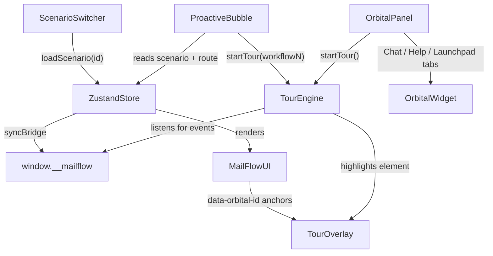

# Orbital AI Embedding + Demo Scenarios Plan

## What Exists

The MailFlow prototype at [`mailflow/src/`](mailflow/src/) is already scaffolded:
- All 10 screens built (`DashboardPage`, `CampaignsListPage`, `CampaignCreateWizard`, `AutomationsListPage`, etc.)
- Zustand store with seed data, actions, and `window.__mailflow` bridge
- `OrbitalSlot.tsx` renders `<div id="orbital-root" />` — the mount point awaiting the real widget
- `ids.ts` has the complete `ORBITAL_IDS` registry
- `bridge.ts` emits all lifecycle events

---

## Part 1: Orbital AI Widget

Replace the no-op `OrbitalSlot` with a fully functional widget. New files under `src/orbital/`:

```
src/orbital/
  OrbitalWidget.tsx       ← top-level widget: FAB + panel
  OrbitalPanel.tsx        ← sliding panel with tabs (Chat / Help / Launchpad)
  HelpCenter.tsx          ← static help articles list
  Launchpad.tsx           ← list of available tours with "Start" buttons
  ProactiveBubble.tsx     ← contextual nudge bubble (scenario-triggered)
  TourEngine.tsx          ← tour context + hook (useTour)
  TourOverlay.tsx         ← spotlight + step tooltip
  tours/
    workflow1.ts          ← step definitions for Maya scenario
    workflow2.ts          ← step definitions for Devon scenario
```

### Widget UI

- **FAB** — floating button at bottom-right with Orbital logo; badge shows when a proactive suggestion is pending
- **Panel** — slides up from FAB; 3 tabs:
  - **Chat** — conversation history + input (responses are scripted/canned for the prototype)
  - **Help Center** — 5–6 static help articles (links are inert)
  - **Launchpad** — cards for each available tour; "Start tour" button triggers `TourEngine`

### Tour Engine (`TourEngine.tsx`)

Manages a `TourState` (current tour, step index, paused/active) via React context:

```ts
type TourStep = {
  targetId: string;        // ORBITAL_IDS key
  route?: string;          // navigate here before showing step
  message: string;         // Orbital's spoken text
  waitForEvent?: string;   // e.g. 'campaign:sent' — advance when bridge fires this
  autoAdvanceMs?: number;  // advance automatically after N ms (for demo flow)
};
```

`TourOverlay.tsx` reads `targetId`, uses `document.querySelector('[data-orbital-id="..."]')` to find the element, measures its `getBoundingClientRect()`, and renders:
- A semi-transparent full-screen backdrop (`position: fixed; inset: 0; bg-black/40`)
- A "cutout" highlight using `box-shadow: 0 0 0 9999px rgba(0,0,0,0.4)` on the target element (elevated via `z-index`)
- A positioned tooltip card with Orbital avatar, step message, step counter, Back/Next/Done buttons

### Proactive Bubble (`ProactiveBubble.tsx`)

Watches the scenario store slice (added in Part 2). Shows a chat-style nudge bubble near the FAB when conditions are met:
- Scenario 1 active + user on `/` + no campaigns → shows after a 2s delay
- Scenario 2 active + user navigates to `/` → shows immediately

Clicking the CTA in the bubble starts the corresponding tour.

---

## Part 2: Scenario Switcher

### New files
- `src/demo/scenarios.ts` — defines the two data snapshots
- `src/demo/ScenarioSwitcher.tsx` — persistent UI strip

### `scenarios.ts`

Two typed `DemoScenario` objects that describe the full store state to load:

**Scenario 1 — Maya (New User Activation)**
- User: `{ plan: 'free', name: 'Maya Chen' }`
- Campaigns: `[]` (empty → dashboard shows empty state)
- Flags: `CAMPAIGN_CREATED: false`, `CONTACTS_UPLOADED: false`
- Starting route: `/`
- Orbital trigger: proactive bubble after 2s idle

**Scenario 2 — Devon (Trial Conversion)**
- User: `{ plan: 'pro', name: 'Devon Park' }` + trial metadata (`trialDaysLeft: 4`)
- Campaigns: 3 sent campaigns with moderate stats, `active_tests: 0`
- Automations: existing automations list is empty (key: Devon hasn't used automation yet)
- Flags: `CAMPAIGN_CREATED: true`, `CONTACTS_UPLOADED: true`
- Starting route: `/`
- Orbital trigger: immediate proactive bubble on dashboard load

### `ScenarioSwitcher.tsx`

A fixed banner at the **top of the viewport** (above the app shell, `z-index: 9999`):

```
[ Orbital.ai Demo ]  [ Scenario 1: Maya — New User ]  [ Scenario 2: Devon — Trial Conversion ]
                              ← active pill highlighted
```

On click: calls `store.loadScenario(id)` → resets Zustand state to scenario snapshot, resets `TourEngine` state, navigates to scenario's starting route via `useNavigate`.

### Store changes (`src/store/index.ts`)

Add a `loadScenario(scenarioId)` action that:
1. Replaces the full store state with the scenario's data snapshot
2. Clears all tour/UI state
3. Calls `syncBridge(route)` to update `window.__mailflow`

---

## Part 3: Tour Step Definitions

### `workflow1.ts` — Maya: First Campaign Sent

Key steps (condensed from the 8-step user journey):

1. **Dashboard** (`dashboard-quickstart-create`) — *"Looks like you're setting up your first campaign. Let's walk through it."*
2. **Campaigns list** (`campaigns-list-create-btn`) → navigate to `/campaigns` — *"Click 'Create campaign' to begin."* — waitForEvent: route change to `/campaigns/new`
3. **Template step** (`wizard-step-template`) — *"Start by choosing a template. For newsletters, these tend to perform best."*
4. **Audience step** (`wizard-step-audience`) — *"Not sure who to send this to? Most first campaigns go to your full contact list."*
5. **Content step** (`wizard-subject-input`) — *"Your subject line drives opens. Try something clear and benefit-driven."*
6. **Review step** (`wizard-send-btn`) — *"You're ready to send your first campaign. Review everything, then click Send."* — waitForEvent: `campaign:sent`
7. **Post-send** (no target, modal-style) — *"Nice work — your first campaign is live! Want tips on tracking performance?"*

### `workflow2.ts` — Devon: Trial Conversion / Automation Discovery

Key steps:

1. **Dashboard** (`dashboard-recent-campaigns`) — *"You're getting good engagement. Let's set up an automation to follow up automatically."*
2. **Automations tab** (`sidebar-automations`) → navigate to `/automations` — *"This is where you create automated workflows."*
3. **Create automation** (`automations-create-btn`) — *"Click here to build your first automation."*
4. **Trigger node** (`automations-trigger-node`) — *"Choose what starts the automation — for example, 'Email not opened'."*
5. **Add step** (`automations-add-step-btn`) — *"Now add your follow-up email here."*
6. **Completion** (modal-style) — *"Nice — this automation will help you recover missed engagement."*
7. **Conversion nudge** (`settings-upgrade-btn`) → navigate to `/settings?tab=billing` — *"You've started using automations — upgrading ensures they keep running after your trial ends."*

---

## Data Flow Summary



---

## File Change Summary

| File | Action |
|---|---|
| `src/orbital/OrbitalSlot.tsx` | Import and render `OrbitalWidget` |
| `src/orbital/OrbitalWidget.tsx` | New — FAB + panel container |
| `src/orbital/OrbitalPanel.tsx` | New — tabbed panel |
| `src/orbital/HelpCenter.tsx` | New — static help articles |
| `src/orbital/Launchpad.tsx` | New — tours list |
| `src/orbital/ProactiveBubble.tsx` | New — contextual nudge |
| `src/orbital/TourEngine.tsx` | New — tour context + hook |
| `src/orbital/TourOverlay.tsx` | New — spotlight + tooltip |
| `src/orbital/tours/workflow1.ts` | New — Maya tour steps |
| `src/orbital/tours/workflow2.ts` | New — Devon tour steps |
| `src/demo/scenarios.ts` | New — scenario data snapshots |
| `src/demo/ScenarioSwitcher.tsx` | New — switcher banner |
| `src/store/index.ts` | Add `loadScenario()` action + `activeScenario` slice |
| `src/App.tsx` | Mount `ScenarioSwitcher` above shell |
